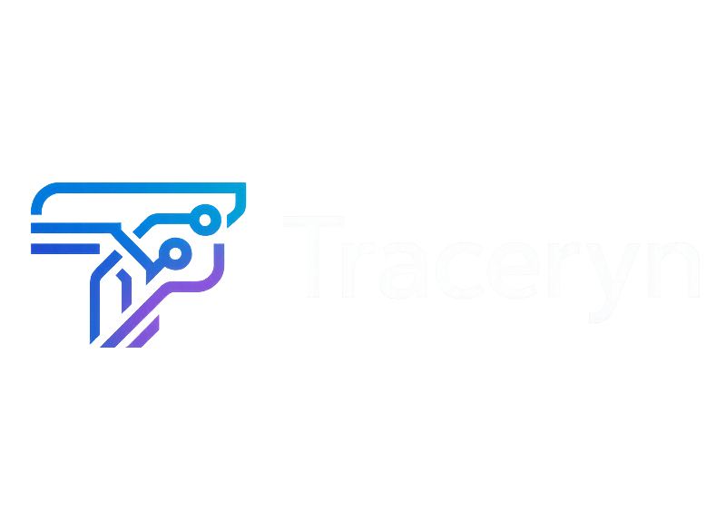

# ***Traceryn/Tiktok-sdk***
A lightweight TikTok SDK for Node.js that makes it easier to fetch videos, users, comments, playlists, hashtags, and other TikTok data in a clean, structured way.

> [!WARNING]
> Work in progress: this project is not finished yet and may change or break without notice. Please do not rely on it for production or active use.


## Disclaimer

> [!CAUTION]
> This project is not affiliated with, endorsed by, or officially connected to TikTok or ByteDance.
> TikTok and related names, marks, logos, and images are trademarks of their respective owners.
>
> This SDK is provided for legitimate development use only. Use it at your own discretion and in accordance with TikTok's terms and applicable laws.

## How it works

- This SDK talks to TikTok through web endpoints and structured responses.
- Playwright is optional and only helps when a browser-backed session makes sense.
- That keeps the setup lighter for normal use and avoids needing a full browser just to start.
- It supports videos, users, comments, hashtags, playlists, sounds, and search data.

> [!IMPORTANT]
> This project is an unofficial TikTok SDK and depends on public endpoints and scraping behavior that may change at any time. Some features may require proxies, Playwright, or additional setup depending on your environment. Use responsibly and make sure your usage follows TikTok's terms and applicable laws.

> [!IMPORTANT]
> Some endpoints (`searchUsers`, `getSound`, `getSoundVideos`) are blocked by Akamai WAF from datacenter IPs. Pass `--session` to use a Playwright browser session that bypasses WAF.
>
> ```sh
> npm install playwright
> node docs/examples/getComments.cjs --session
> ```

> [!IMPORTANT]
> For deployment, use a VPS or another long-running server. This project runs into IP restrictions and blocks on most serverless hosts, so only a few platforms will work reliably. Vercel is a bad fit here, and Render only makes sense if you're using a service that stays up as a real web process.

## Install

### Stable release

```sh
npm install @traceryn/tiktok-sdk
```

```sh
yarn add @traceryn/tiktok-sdk
```

### From GitHub

```sh
npm install git+https://github.com/traceryn/tiktok-sdk.git
```

```sh
yarn add git+https://github.com/traceryn/tiktok-sdk.git
```

### Optional: Playwright

```sh
npm install playwright
```

```sh
yarn add playwright
```

## Then import your code using:

```ts
import { TikTokClient } from '@traceryn/tiktok-sdk';

const client = new TikTokClient();
```

or

```js
const { TikTokClient } = require('@traceryn/tiktok-sdk');

const client = new TikTokClient();
```
> [!NOTE]
> Check the [examples](docs/examples) directory for runnable example scripts with the session pattern.

### Main methods

- `getVideo(url)` // get video data from a TikTok link
- `getUser(usernameOrUrl)` // get user profile data
- `getComments(videoUrl)` // get comments from a video or post
- `searchUsers(query)` // search for users
- `getHashtag(name)` // get hashtag stats
- `getSound(musicId)` // get sound info
- `getSoundVideos(musicId)` // get videos using a sound
- `getTrendingVideos()` // get trending videos
- `getUserLikedVideos(username)` // get videos a user liked
- `getUserPlaylists(username)` // get playlists for a user
- `getPlaylist(mixId)` // get one playlist
- `getPlaylistVideos(mixId)` // get videos inside a playlist
- `addProxies(proxies)` // add your own proxies
- `getProxyStats()` // check proxy usage
- `invalidateCache(url)` // clear one cached video
- `clearCache()` // clear all cached video data

## Examples

### Basic usage

```ts
import { TikTokClient } from '@traceryn/tiktok-sdk';

const client = new TikTokClient();

const video = await client.getVideo('https://www.tiktok.com/@user/video/1234567890');
console.log(video.title);
```

Gets one video and prints its title.

### Other methods

```ts
const user = await client.getUser('tiktok');
console.log(user.nickname);
```

Gets a user profile from a username or profile link.

```ts
const comments = await client.getComments('https://www.tiktok.com/@user/video/1234567890');
console.log(comments.comments.length);
```

Gets the comments for a video or post.

```ts
const hashtag = await client.getHashtag('fyp');
console.log(hashtag.stats.videoCount);
```

Gets hashtag info and the number of videos tied to it.

```ts
const search = await client.searchUsers('tiktok');
console.log(search.users.length);
```

Searches for TikTok users by keyword.

```ts
const trending = await client.getTrendingVideos();
console.log(trending.videos.length);
```

Gets the current trending videos.

### Using Playwright session

```js
const { TikTokClient, PlaywrightSession } = require('@traceryn/tiktok-sdk');

async function main() {
	const useSession = process.argv.includes('--session');
	let session;

	if (useSession) {
		session = new PlaywrightSession({ headless: true });
		await session.init();
	}

	const client = new TikTokClient({ session });
	const trending = await client.getTrendingVideos();

	console.log(trending.videos.length);

	if (session) await session.close();
}

main().catch((err) => {
	console.error('Error:', err.message);
	process.exit(1);
});
```

### Settings

```ts
import { TikTokClient } from '@traceryn/tiktok-sdk';

const client = new TikTokClient({
	timeout: 15000, // keep requests from hanging too long
	maxRetries: 2, // retry a couple times if TikTok flakes out
	rateLimit: 3, // slow it down a bit
	concurrency: 1, // keep it simple and steady
	cacheTTL: 60_000, // cache results for a minute
});
```

| Option | What you can change it to |
| --- | --- |
| `timeout` | Any number in milliseconds, like `5000`, `15000`, or `30000` |
| `maxRetries` | Any whole number, like `0`, `2`, or `5` |
| `rateLimit` | Any whole number, like `1`, `3`, or `10` |
| `concurrency` | Any whole number, like `1`, `2`, or `4` |
| `cacheTTL` | Any number in milliseconds, like `30000`, `60000`, or `300000` |

You can also pass `session` if you want the Playwright path, or `proxy` / `proxyRotation` if you want to manage proxies a bit more directly.

> [!NOTE]
> You can also check [HERE](docs/responses) to see example response data for the main methods.

## Running tests

```sh
npm test
```

That runs the Vitest suite for this repo. Most of the tests are local, but some checks still depend on TikTok behavior and can shift when the site changes.

If you want a slightly wider check while you're working on the SDK, you can also run:

```sh
npm run typecheck
```

```sh
npm run lint
```

If you're only testing one area, keep the focus tight and run the smallest check that covers your change.

## Sponsor
If you'd like to financially support this project, you can do so by supporting the current maintainer [HERE](https://paystack.shop/pay/corex24)

## Contributing

See [CONTRIBUTING.md](CONTRIBUTING.md) for how to contribute, and [SECURITY.md](SECURITY.md) for how to report security issues.

## LICENSE
Copyright (c) 2026 Corex Anthony

Licensed under the MIT License: Permission is hereby granted, free of charge, to any person obtaining a copy
of this software and associated documentation files (the "Software"), to deal
in the Software without restriction, including without limitation the rights
to use, copy, modify, merge, publish, distribute, sublicense, and/or sell
copies of the Software, and to permit persons to whom the Software is
furnished to do so, subject to the following conditions:

The above copyright notice and this permission notice shall be included in all
copies or substantial portions of the Software.

THE SOFTWARE IS PROVIDED "AS IS", WITHOUT WARRANTY OF ANY KIND, EXPRESS OR
IMPLIED, INCLUDING BUT NOT LIMITED TO THE WARRANTIES OF MERCHANTABILITY,
FITNESS FOR A PARTICULAR PURPOSE AND NONINFRINGEMENT. IN NO EVENT SHALL THE
AUTHORS OR COPYRIGHT HOLDERS BE LIABLE FOR ANY CLAIM, DAMAGES OR OTHER
LIABILITY, WHETHER IN AN ACTION OF CONTRACT, TORT OR OTHERWISE, ARISING FROM,
OUT OF OR IN CONNECTION WITH THE SOFTWARE OR THE USE OR OTHER DEALINGS IN THE
SOFTWARE.
